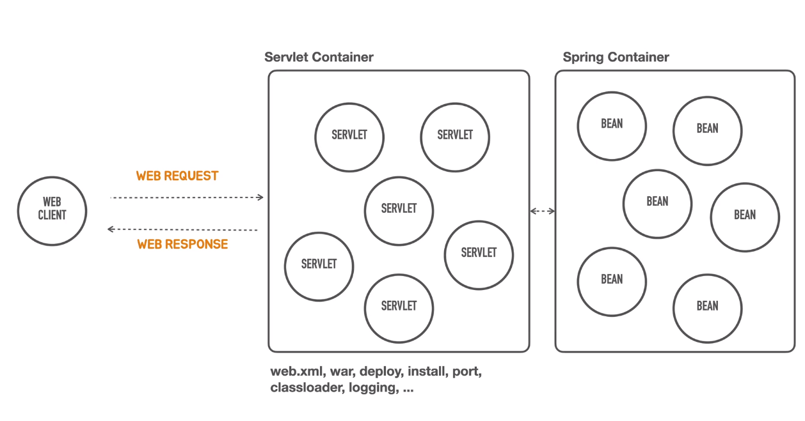
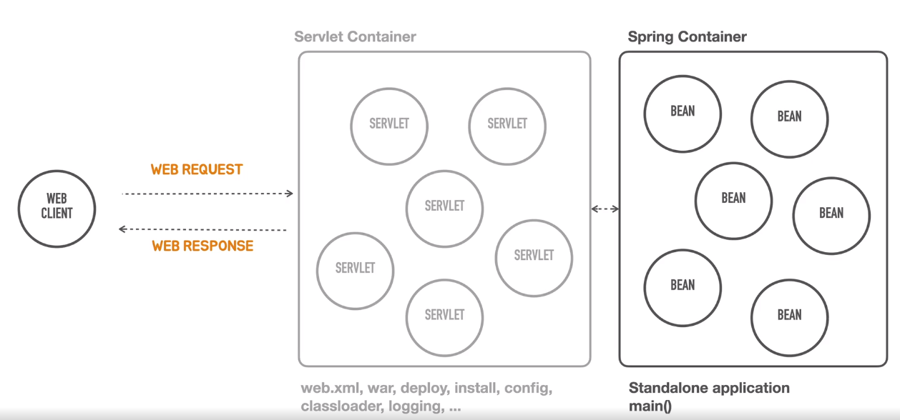

# Spring Boot 시작하기

### 스프링 부트란?

- 스프링을 확장하고 있는 프레임워크, 유용한 라이브러리
- **스프링 기반**으로 실무 환경에 사용 가능한 수준의 독립실행형 어플리케이션을 빠르게 작성할 수 있게 도와주는 여러가지 도구의 모음 
- :bulb: 스프링 !== 스프링 부트

### 스프링 부트의 핵심 목표

- 빠르고 광범위한 스프링 개발 경험 제공
- 강한 주장을 가지고 즉시 적용 가능한 기술 제공, but 필요에 따라 원하는 방식으로 변형 용이
- 프로젝트에서 필요로 하는 다양한 기술(보안, 메트릭, 상태 체크, 내장형 서버, 외부 설정 방식 등) 제공
- 코드 생성이나 XML 설정을 필요로 하지 않음

### 스프링 부트의 역사

- 2012년 스프링 프레임워크 프로젝트 이슈에 등록된 "Containerless 웹 개발 아키텍처의 지원" 요청에서 논의와 개발
  시작 (https://github.com/spring-projects/spring-framework/issues/14521)

### Containerless 컨테이너리스 웹 어플리케이션 아키텍처

- Serverless : 서버(Servlet Conatiner)에 대한 설치/관리를 신경쓰지 않고 어플리케이션(Spring Container) 개발이 가능하도록 하는 것
- Web Container(Servlet Container) : life cycle 관리, 여러개의 web component(Servlet)들을 관리, request와 web component(Servlet)
  매핑(라우팅) 작업
- Spring Container : Servlet Container 뒷단에서 작업하는 Bean  
- Servlet Container and Spring Container
  
- Standalone application
 

### Servlet Container VS Spring Container      

### Opinionated

- 스프링 프레임워크의 설계 철학 
  &nbsp; 1. 극단적인 유연함 추구 
  &nbsp; 2. 다양한 관점 수용 
  &nbsp; 3. Not opinionated 
  &nbsp; 4. 수많은 선택지 포용  

- 스프링 부트의 설계 철학 
  &nbsp; 1. Opinionated : 자기 주장이 강한, 독선적인 
  &nbsp; 2. 일단 정해주는대로 빠르게 개발하고 고민은 나중에 
  &nbsp; 3. 스프링을 잘 활용하는 방법 제공 
  &nbsp; 4. 도메인 개발에 집중 가능 
  &nbsp;  :bulb:  검증된 스프링 생태계 프로젝트, 표준 자바 기술, 오픈소스 기술의 종류와 의존관계, 사용 버전 정해줌, 각 기술을 스프링에 적용하는 방식(DI 구성)과 default 설정 값
  제공 
  &nbsp;  :bulb:  디폴트 구성 커스터마이징 하는 방법 유연하게 제공, 스프링 부트에서 제공하는 자신만의 모듈 작성 가능  

**"프레임워크를 효과적으로 재사용하기 위해서는 프레임워크의 최종 모습 뿐만 아니라 현재의 모습을 띠게 되기까지 진화한 과정을 살펴 보는 것이 가장 효과적이다. 프레임워크의 진화 과정 속에는 프레임 워크의 구성 원리
및 설계 원칙, 재사용 가능한 컨텍스트와 변경 가능성에 곤련된 다양한 정보가 들어 있기 때문이다."
 - 조영호**