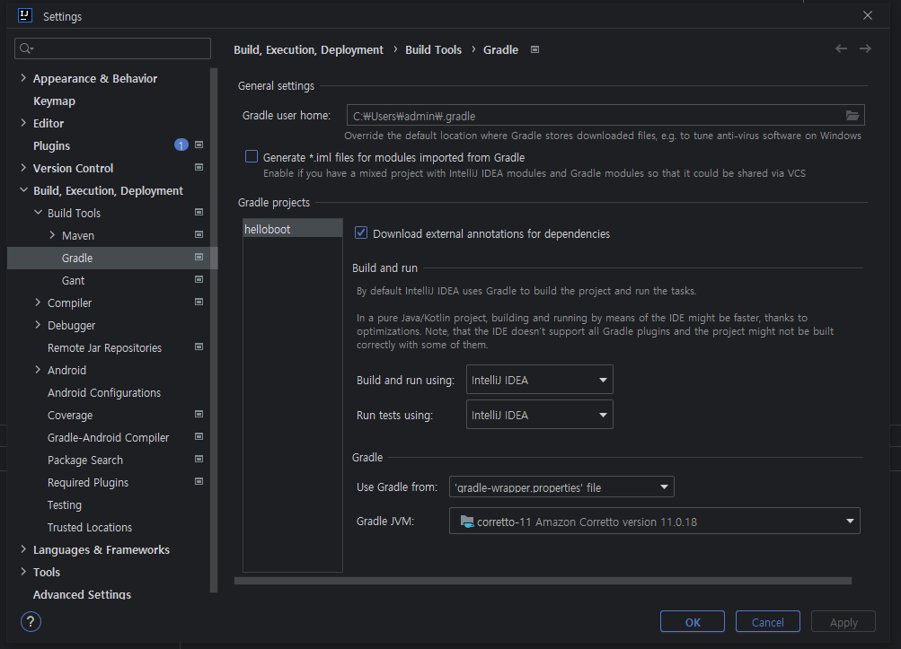
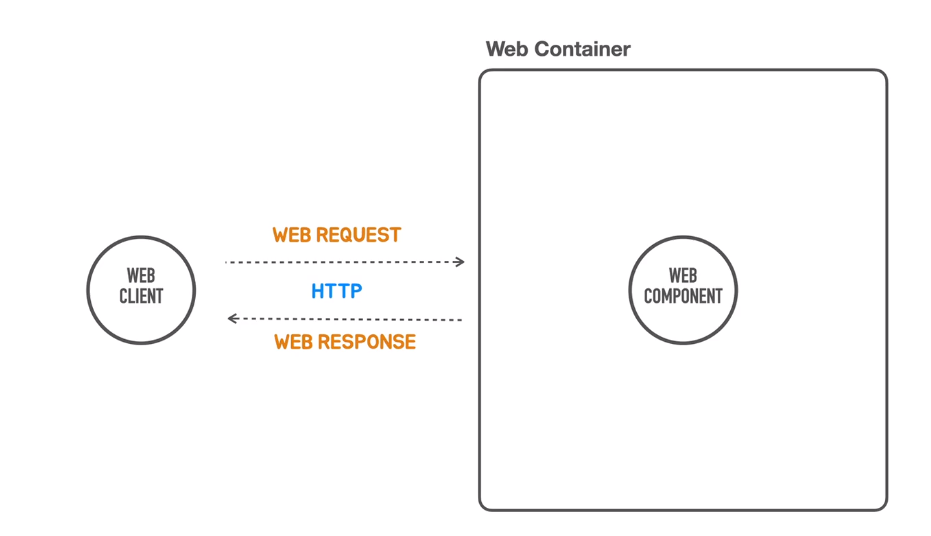
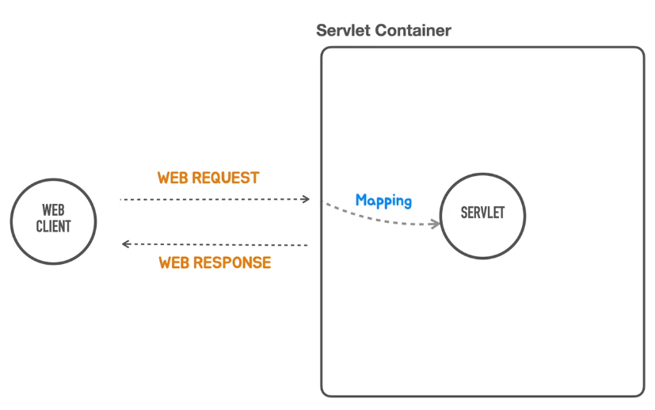
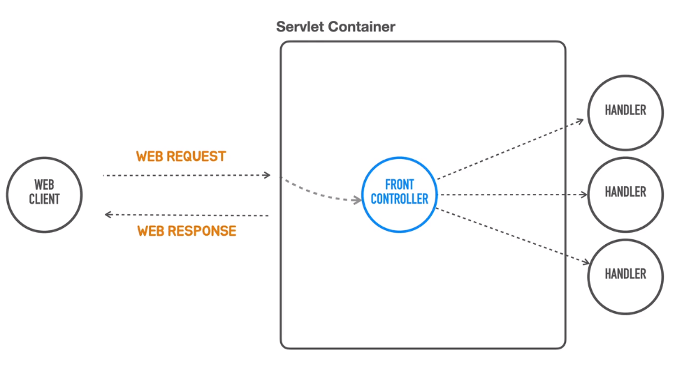

# Spring Boot 시작하기

### intellij - sdkman java 설치 경로로 설정


### API Test
- HTTP 요청을 만들고 응답을 확인하는데 사용되는 도구<br/>
  &nbsp;&nbsp; 1. 웹브라우저 개발자 도구<br/>
  &nbsp;&nbsp; 2. curl<br/>
  &nbsp;&nbsp; 3. HTTPie<br/>
  &nbsp;&nbsp; 4. PostMan,Insomnia<br/>
  &nbsp;&nbsp; 5. JUnitT Test<br/>

### Web 어플리케이션 동작 방식


**Reqeuset**
- Request Line : Method(GET, POST, PUT, PATCH, DELETE), Path, HTTP Version
- Headers(Accept, Accept-Encoding, ..)
- Message Body

**Response**
- Status Line : HTTP Version, **Status Code**, Status Text
- Headers(Content-Type, Content-Length)
- Message Body

### Stand Alone Servlet Container 개발
```java
package tobyspring.helloboot;

import org.springframework.boot.SpringApplication;
import org.springframework.boot.autoconfigure.SpringBootApplication;

@SpringBootApplication
public class HellobootApplication {

	public static void main(String[] args) {
		SpringApplication.run(HellobootApplication.class, args);
	}

}
```
<br/>

- @SpringBootApplication 어노테이션 제거 후 Severlet Container 만들기(Embeded tomcat사용)

```java
package tobyspring.helloboot;

import org.apache.catalina.startup.Tomcat;
import org.springframework.boot.web.embedded.tomcat.TomcatServletWebServerFactory;
import org.springframework.boot.web.server.WebServer;
import org.springframework.boot.web.servlet.server.ServletWebServerFactory;

public class HellobootApplication {

	public static void main(String[] args) {
		ServletWebServerFactory serverFactory = new TomcatServletWebServerFactory();
		WebServer webServer = serverFactory.getWebServer();
		webServer.start();
	}
}
```
<br/>
<br/>

- ServletContainer 설치/배포 없이 java 코드로 sevlet 등록 및 매핑 작업과정 작성
  <br/>
  
  <br/>
```java
package tobyspring.helloboot;

import org.springframework.boot.web.embedded.tomcat.TomcatServletWebServerFactory;
import org.springframework.boot.web.server.WebServer;
import org.springframework.boot.web.servlet.server.ServletWebServerFactory;

import javax.servlet.ServletException;
import javax.servlet.http.HttpServlet;
import javax.servlet.http.HttpServletRequest;
import javax.servlet.http.HttpServletResponse;
import java.io.IOException;

public class HellobootApplication {

  public static void main(String[] args) {
    ServletWebServerFactory serverFactory = new TomcatServletWebServerFactory();
    WebServer webServer = serverFactory.getWebServer(servletContext -> {
      servletContext.addServlet("hello", new HttpServlet() {
        @Override
        protected void service(HttpServletRequest req, HttpServletResponse resp) throws ServletException, IOException {
          resp.setStatus(200);
          resp.setHeader("Content-Type", "text/plain");
          resp.getWriter().println("Hello Servlet");
        }
      }).addMapping("/hello");
    });
    webServer.start();
  }
}
```
<br/>

- 하드코딩 -> enum으로 수정 및 query parameter 추가
```java
package tobyspring.helloboot;

import org.springframework.boot.web.embedded.tomcat.TomcatServletWebServerFactory;
import org.springframework.boot.web.server.WebServer;
import org.springframework.boot.web.servlet.server.ServletWebServerFactory;
import org.springframework.http.HttpHeaders;
import org.springframework.http.HttpStatus;
import org.springframework.http.MediaType;

import javax.servlet.ServletException;
import javax.servlet.http.HttpServlet;
import javax.servlet.http.HttpServletRequest;
import javax.servlet.http.HttpServletResponse;
import java.io.IOException;

public class HellobootApplication {

  public static void main(String[] args) {
    ServletWebServerFactory serverFactory = new TomcatServletWebServerFactory();
    WebServer webServer = serverFactory.getWebServer(servletContext -> {
      servletContext.addServlet("hello", new HttpServlet() {
        @Override
        protected void service(HttpServletRequest req, HttpServletResponse resp) throws ServletException, IOException {
          String name = req.getParameter("name");

          resp.setStatus(HttpStatus.OK.value());
          resp.setHeader(HttpHeaders.CONTENT_TYPE, MediaType.TEXT_PLAIN_VALUE);
          resp.getWriter().println("Hello " + name);
        }
      }).addMapping("/hello");
    });
    webServer.start();
  }
}
```
<br/>

### Front Controller
- servlet mapping 개선 필요 : servlet 코드에 매핑 코드 부분이 중복해서 나타나게 됨, req, resp object를 직접 다루는게 자연스럽지 않음.
- front controller : 어떤 로직을 수행할지 메서드 매핑, 공통작업은 front controller에서 처리(인증, 보안, 다국어 처리)하고 그 후 로직은 다른 object에 위임.
1. mapping : request에 들어있는 정보를 통해 어떠한 로직을 수행할지 결정하는 작업.
2. binding : controller를 만들때 직접 req, resp object를 직접 다루기 보다 request 타입을 평범한 java type(dto, java bean...)으로 변환
   
   <br/>

```java
public class HellobootApplication {

  public static void main(String[] args) {
    ServletWebServerFactory serverFactory = new TomcatServletWebServerFactory();
    WebServer webServer = serverFactory.getWebServer(servletContext -> {
      HelloController helloController = new HelloController();

      servletContext.addServlet("frontcontroller", new HttpServlet() {
        @Override
        protected void service(HttpServletRequest req, HttpServletResponse resp) throws ServletException, IOException {
          // 인증, 보안, 다국어, 공통 기능
          // 매핑
          if (req.getRequestURI().equals("/hello") && req.getMethod().equals(HttpMethod.GET.name())) {
            String name = req.getParameter("name");

            // 다른 객체에 위임(바인딩)
            String ret = helloController.hello(name);

            resp.setStatus(HttpStatus.OK.value());
            resp.setHeader(HttpHeaders.CONTENT_TYPE, MediaType.TEXT_PLAIN_VALUE);
            resp.getWriter().println(ret);
          } else if (req.getRequestURI().equals("/user")) {
            //
          } else{
            resp.setStatus(HttpStatus.NOT_FOUND.value());
          }
        }
      }).addMapping("/*");
    });
    webServer.start();
  }
}
```