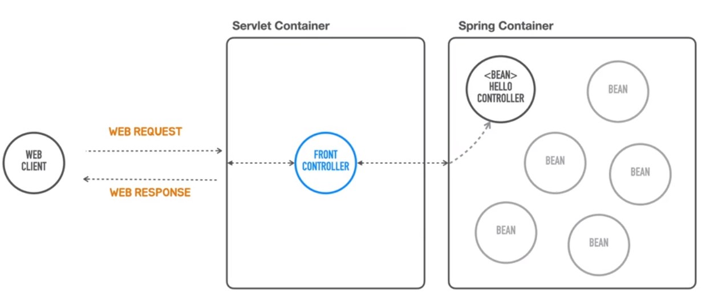

### Stand Alone Spring Container  개발

 
- Spring Container : Business Object Code와 Configuration Metadata를 조합하여 내부의 bean object를 구성 -> server application으로 만들어줌.

https://docs.spring.io/spring-framework/docs/5.3.x/reference/html/core.html#spring-core

### Depentency Injection

- HelloController는 SimpleHelloService에 의존하고 있음.
- 다른 서비스를 적용하고 싶거나 다른 클래스를 참조하게 되면 HelloController에 수정이 필요함.

_images/9410d2ca.png)
- interface를 통해 구현하면 HelloController의 코드를 수정하지 않아도 됨.
- **소스코드 레벨에서는 특정 클래스에 의존하지 않기 때문**
- But, 런타임에서는 특정 클래스의 메서드를 사용하기 위해 연관관계가 생기게 됨.
- HelloController에서 직접 new로 Object를 생성하지 않고 외부에서 Object를 만들어서 주입해주는데 이 역할을 해주는것을 Assembler라고 함.
- 이 Assembler를  Spring Container라고 함.
- Spring Container의 역할은 Singleton Object를 만들고 그 Object를 주입해주는 역할을 함.
- Interface를 중간에 두고 코드레벨의 의존관계를 제거한 후에 Assembler를 통해 동적으로 주입하여 두 객체 사이의 관계를 만드는 것을 DI라고 함. 